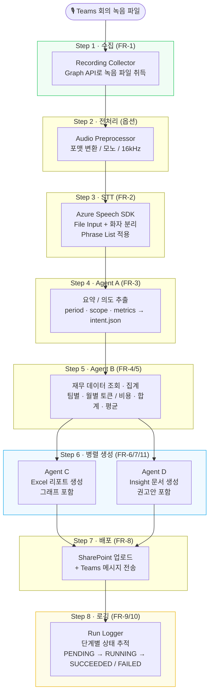
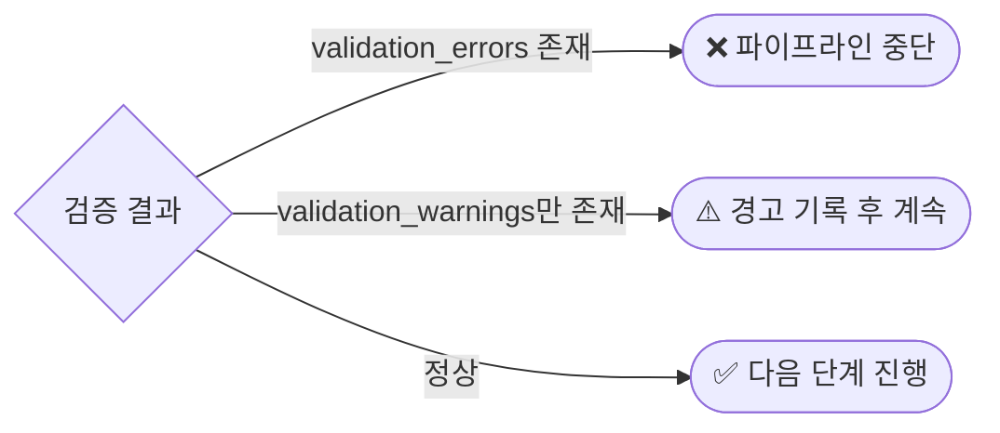

# Elite Secretary

> **Teams 회의 녹음 → LLM 비용 분석 산출물 자동 생성 Agent**

조직 내 재무 요청은 회의에서 구두로 전달되는 경우가 많습니다. *Elite Secretary*는 Teams 회의 녹음 파일 하나를 입력으로 받아, 회의 종료 후 LLM 사용량·비용 분석 Excel과 Insight 문서를 사람의 개입 없이 자동 생성하는 End-to-End AI Agent 워크플로우입니다.

---

## 목차

1. [Pain Point](#1-pain-point)
2. [우리의 솔루션](#2-우리의-솔루션)
3. [비즈니스 임팩트](#3-비즈니스-임팩트)
4. [시스템 아키텍처](#4-시스템-아키텍처)
5. [구현 현황](#5-구현-현황)
6. [프로젝트 구조](#6-프로젝트-구조)
7. [실행 방법](#7-실행-방법)
8. [개발 한계 및 실패 원인](#8-개발-한계-및-실패-원인)
9. [참고 자료](#9-참고-자료)

---

## 1. Pain Point

### 조직의 재무 리포팅이 여전히 수작업에 묶여 있다

조직 내 재무·기술 관련 요청은 대부분 회의에서 구두로 전달되고, 회의 이후 아래 수작업이 반복된다.

| 수작업 단계 | 소요 시간 | 가치 창출 여부 |
|---|---|---|
| 회의 내용 수동 정리·요약 | 높음 | ❌ |
| 요청 의도 파악 및 업무 이관 | 높음 | ❌ |
| 수치 데이터 취합 (Excel, DB 등) | 매우 높음 | ❌ |
| 재무/의사결정 문서 작성 | 매우 높음 | ⚠️ 부분적 |
| **실제 인사이트 도출 및 의사결정** | **낮음** | **✅** |

### 핵심 문제: 시간이 잘못된 곳에 쓰이고 있다

> "업무 시간의 대부분이 데이터를 찾고 준비하는 데 소모되고, 실제 분석과 인사이트 도출에는 극히 일부만 사용된다."

재무 담당자는 데이터를 **만드는** 사람이어야 하는데, 현실에서는 데이터를 **모으는** 사람이 되어버린다.

---

## 2. 우리의 솔루션

### Teams 회의 녹음 → 재무 문서 자동 생성

**시나리오**: 팀장이 회의 중 재무담당자에게 구두로 요청한다.

> *"올해 상반기 전사 LLM 토큰 사용량과 비용을 정리해 주세요."*

**Elite Secretary가 하는 일**: 회의가 끝나면 아래 파이프라인이 자동 실행된다.

1. **회의 녹음 수집** — Teams Graph API로 회의 녹음 파일 자동 취득
2. **STT** — Azure Speech SDK로 회의 전문(全文) 변환 + 화자 분리
3. **의도 추출** (Agent A) — 기간·대상·지표 유형을 구조화된 Intent로 추출
4. **데이터 조회·집계** (Agent B) — 사내 재무 Excel에서 팀별·월별 토큰/비용 집계
5. **Excel 리포트 생성** (Agent C) — 그래프 포함 재무 분석 Excel 자동 생성
6. **Insight 문서 생성** (Agent D) — 수치 기반 인사이트 + 권고안 문서 자동 작성
7. **결과 배포** — SharePoint 업로드 + Teams 메시지로 링크 전송

**산출물**:
- 📊 팀별/월별 토큰·비용 집계 + 그래프가 포함된 재무 분석 Excel
- 📄 비용 편중·비효율 패턴 분석 + 실행 가능한 권고안이 담긴 Insight 문서

---

## 3. 비즈니스 임팩트

### 정량적 문제 규모

**데이터 준비·정제에 80%의 시간이 소모된다**

IDC는 "데이터 발견·준비·보호에 전체 업무 시간의 80%가 소모되고, 실제 분석과 인사이트 도출에는 단 20%만 사용된다"고 발표했다. 이는 데이터 담당자가 고부가 가치 업무보다 단순 준비 작업에 훨씬 많은 시간을 쓰고 있음을 의미한다.<sup>[[1]](#ref1)[[2]](#ref2)</sup>

**수동 리포팅 작업에 매주 10~15시간 낭비**

실무 분석가들은 수동 리포팅 작업에 매주 평균 10~15시간을 소모하고 있다. 연간으로 환산하면 직원 1인당 520~780시간이 인사이트 도출이 아닌 단순 집계·정리 작업에 쓰이는 셈이다.<sup>[[3]](#ref3)</sup>

### Elite Secretary가 만드는 변화

| 지표 | Before | After |
|---|---|---|
| 회의 → 문서 완성까지 걸리는 시간 | 수 시간 ~ 수 일 | **10분 이내** (외부 API 지연 제외) |
| 사람이 직접 해야 하는 작업 | 전체 | **트리거 1회** |
| 재무 담당자의 고부가가치 업무 집중도 | 낮음 | **높음** |
| 동일 구조로 확장 가능한 업무 범위 | 단일 태스크 | **모든 반복적 재무·운영 리포팅** |

---

## 4. 시스템 아키텍처

### 전체 파이프라인 흐름



### 에러 처리 정책



---

## 5. 구현 현황

### ✅ 구현 완료 (FR-4 ~ FR-11)

| 기능 요구사항 | 설명 | 상태 |
|---|---|---|
| FR-4 | 사내 재무 Excel에서 팀별/월별 데이터 조회 | ✅ |
| FR-5 | 토큰/비용 집계, 합계·평균 계산 | ✅ |
| FR-6 | 그래프 포함 Excel 리포트 자동 생성 | ✅ |
| FR-7 | 수치 기반 Insight 문서 자동 생성 | ✅ |
| FR-8 | 데모 트리거 기반 순차 파이프라인 실행 + 상태 추적 | ✅ |
| FR-9 | 단계별 입출력 로그 + 실패 원인 기록 | ✅ |
| FR-10 | 오류 처리 (파일 없음, 데이터 누락, 검증 error/warning 분리) | ✅ |
| FR-11 | Agent C / Agent D 병렬 실행 | ✅ |

### ❌ 미구현 (FR-1 ~ FR-3)

| 기능 요구사항 | 설명 | 미구현 사유 |
|---|---|---|
| FR-1 | Teams 녹음 파일 자동 수집 | 아래 [개발 한계](#8-개발-한계-및-실패-원인) 참조 |
| FR-2 | Azure Speech SDK STT + 화자 분리 | FR-1 미구현으로 인한 연쇄 미구현 |
| FR-3 | Agent A 회의 요약 / 의도 추출 | FR-2 미구현으로 인한 연쇄 미구현 |

---

## 6. 프로젝트 구조

```text
elite-secretary/
├── data/
│   ├── seed/                          # 직원별 LLM 사용 성향 seed 데이터
│   └── generated/manual/             # 수동 검증용 재무 원천 데이터 + 산출물
├── scripts/
│   └── generate_llm_credit_db.py     # seed 및 재무 샘플 데이터 생성 스크립트
├── src/
│   ├── app/
│   │   ├── main.py                   # 엔트리포인트
│   │   └── config.py                 # 환경변수/설정 로딩
│   ├── integrations/
│   │   ├── graph_client.py           # Graph API 인증/호출 (httpx)
│   │   ├── teams_recording_resolver.py  # 녹음 파일 위치 탐색
│   │   ├── speech_stt.py             # Azure Speech SDK wrapper
│   │   ├── audio_preprocessor.py     # 오디오 포맷 변환
│   │   ├── sharepoint_publisher.py   # 결과 업로드/링크 생성
│   │   └── teams_notifier.py         # Teams 메시지 전송
│   ├── pipeline/
│   │   ├── orchestrator.py           # 전체 단계 제어
│   │   └── state_store.py            # 실행 상태/로그 저장
│   ├── agents/
│   │   ├── agent_a_intent.py         # 요약/의도 추출
│   │   ├── agent_b_aggregation.py    # 데이터 조회/집계
│   │   ├── agent_c_excel.py          # Excel 생성
│   │   └── agent_d_insight.py        # Insight 문서 생성
│   ├── domain/
│   │   ├── models.py                 # Pydantic 도메인 모델
│   │   └── errors.py                 # 명시적 에러 타입
│   └── llm_financial_workflow/       # LangChain + LangGraph 기반 워크플로우
├── workflow_runs/<run_id>/           # 실제 워크플로우 실행 결과물
├── requirements.md
├── design.md
└── pyproject.toml
```

---

## 7. 실행 방법

### 사전 요구사항

- Windows 환경 + Microsoft Excel Desktop 2016 이상
- Python 3.11+, [uv](https://github.com/astral-sh/uv)
- `.env` 파일에 아래 환경 변수 설정:

```env
AZURE_TENANT_ID=...
AZURE_CLIENT_ID=...
AZURE_CLIENT_SECRET=...
AZURE_SPEECH_KEY=...
AZURE_SPEECH_REGION=...
OPENAI_API_KEY=...
```

### 설치 및 실행

```bash
# 1. 의존성 설치
uv venv .venv
uv sync

# 2. Excel MCP 바이너리 설치 (Windows 전용)
uv run install-excel-mcp
# 또는 로컬 ZIP 사용:
# uv run install-excel-mcp --from-zip /path/to/ExcelMcp-MCP-Server-x.y.z-windows.zip

# 3. 워크플로우 실행 (FR-4~11 데모)
uv run llm-financial-workflow --run-id demo-run --output-dir ./workflow_runs/demo-run
```

### Excel MCP 경로 커스터마이즈

기본 경로 `tools/excel-mcp/mcp-excel.exe`가 아닌 다른 위치를 사용하려면:

```bash
export EXCEL_MCP_COMMAND="C:\\custom\\path\\mcp-excel.exe"
```

### 새 clone 환경 체크리스트

- [ ] `.venv` 생성 및 `uv sync` 완료
- [ ] `mcp-excel.exe` 존재 확인 (`uv run install-excel-mcp` 실행)
- [ ] `.env` 환경 변수 설정 완료
- [ ] Microsoft Excel Desktop 설치 확인

---

## 8. 개발 한계 및 실패 원인

### FR-1~3 미구현: MS Teams 개인용 vs. 기업용 API 차이

본 프로젝트는 **Microsoft Teams Graph API**를 통해 회의 녹음 파일을 자동으로 수집하고, **Azure Speech SDK**로 STT 처리하는 것을 목표로 설계되었다.

그러나 개발 과정에서 **치명적인 환경 불일치**가 발견되었다.

| 구분 | 개발에 사용한 환경 | 설계가 전제한 환경 |
|---|---|---|
| Teams 계정 유형 | **개인용 (Personal)** Microsoft 계정 | **기업용 (Work/School)** Microsoft 365 테넌트 |
| Graph API 회의 녹음 접근 | ❌ 지원 안 됨 | ✅ 지원 |
| Azure AD 앱 등록 권한 | ❌ 부여 불가 | ✅ 관리자 동의로 부여 가능 |
| OneDrive for Business / SharePoint | ❌ 접근 불가 | ✅ 접근 가능 |

**개인용 Microsoft 계정은 기업용 Graph API(회의 녹음, OneDrive for Business, Azure AD 앱 권한 등)를 지원하지 않는다.** 개발팀이 보유한 Teams 계정이 개인용 계정이었기 때문에, FR-1 (녹음 수집) 구현 자체가 불가능했고, 이에 연쇄적으로 FR-2 (STT), FR-3 (의도 추출)도 구현되지 못했다.

**결론**: FR-4~11에 해당하는 재무 문서 자동화 워크플로우는 완전히 동작하며, FR-1~3은 **기업용 Microsoft 365 테넌트 환경에서는 설계 그대로 동작 가능하다**. 본 해커톤의 한계는 솔루션의 설계 결함이 아닌 **개발 환경의 계정 유형 불일치**에 기인한다.

---

## 9. 참고 자료

<a id="ref1"></a>**[1]** Dyvenia — *How Data Marts Streamline Your Analytics* (IDC 인용: "80% of time is spent on data discovery, preparation, and protection, and only 20% of time is spent on actual analytics")
https://dyvenia.com/blogs/business/how-data-marts-streamline-your-analytics/4/

<a id="ref2"></a>**[2]** Amperity — *The Cost of Poor Data Quality* (CrowdFlower/Figure Eight 등 복수 출처 인용: 데이터 준비에 소모되는 시간 비율은 출처/정의에 따라 25~80% 범위)
https://amperity.com/blog/cost-of-poor-data-quality

<a id="ref3"></a>**[3]** Agents for Hire — *The Hidden Cost of Manual Reporting: $42K Annual Loss per 100 Employees* (수동 리포팅에 주당 10~15시간 소모)
https://agentsforhire.ai/blog/the-hidden-cost-of-manual-reporting-42k-annual-loss-per-100-employees

---

> **주요 참고 문서**: [`requirements.md`](./requirements.md) · [`design.md`](./design.md) · [`llm_credit_dataset_design.md`](./llm_credit_dataset_design.md)
